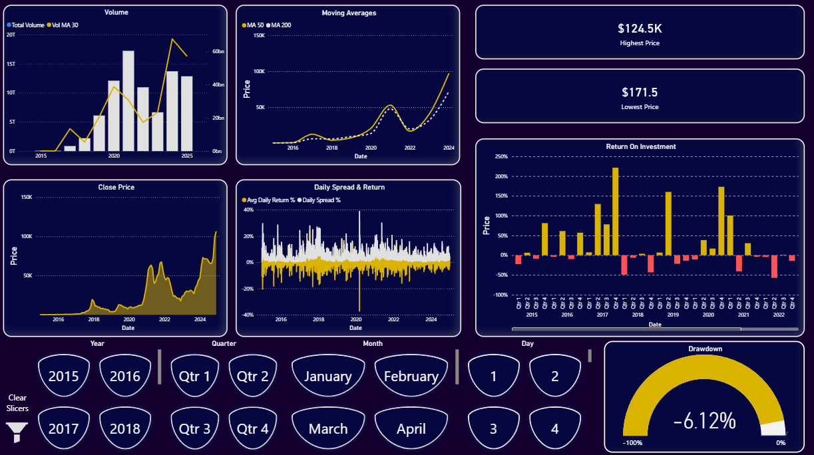

# Bitcoin Price Analysis Dashboard

An end-to-end data analytics project that transforms raw Bitcoin (BTC-USD) price data into an interactive Power BI dashboard, providing insights into historical price trends, trading volume patterns, and volatility metrics over time.

## Dashboard Preview

### Overview  
  

## Project Structure

```
BTC_analysis/
├── Data/
│   └── bitcoin_price_2015_2025.csv       # Raw daily Bitcoin price data (2015–2025)
├── Icons/
│   ├── icon_filter.svg
│   └── icon_filter_white.svg            # Filter icons for visuals
├── Images/
│   ├── Dark_mode.PNG                    # Dashboard screenshot (dark theme)
│   └── Light_mode.PNG                   # Dashboard screenshot (light theme)
├── BTC_Dark_Themed.pbix                 # Power BI report (dark theme)
├── BTC_Light_Themed.pbix                # Power BI report (light theme)
└── Readme.md                            # Project documentation
```

## Data Pipeline

### Source  
Historical daily Bitcoin (BTC-USD) price data, including Date, Open, High, Low, Close, and Volume.  The data source is publicly available cryptocurrency price data (specific provider unspecified).

### ETL Process  
No external ETL script is provided; the CSV data is assumed pre-cleaned. Data quality checks and any additional formatting are handled within Power BI (e.g. data type conversions and calculated measures).

### Cleaned Dataset Schema

| Column | Type    | Description                       |
|--------|---------|-----------------------------------|
| Date   | Date    | Trading date (YYYY-MM-DD)         |
| Open   | Float   | Opening price of BTC (USD)        |
| High   | Float   | Highest price of BTC that day     |
| Low    | Float   | Lowest price of BTC that day      |
| Close  | Float   | Closing price of BTC (USD)        |
| Volume | Integer | Trading volume (in BTC units)     |

## Power BI Dashboard

The dashboard contains a single interactive report page. Key visuals include:

- **Trading Volume & 30-day MA (Chart):** Bar chart showing daily trading volume, overlaid with a 30-day moving average line.  
- **Price Moving Averages (Chart):** Line chart of Bitcoin closing price with additional lines for longer moving averages (e.g. 7-day, 30-day, 200-day).  
- **Close Price with Daily Spread & Return (Combo Chart):** Displays the BTC closing price over time (line) along with bars representing each day’s price spread (High–Low) and a secondary line or markers showing daily return percentage.  
- **KPI Cards:** Individual cards showing key statistics for the filtered period, including **Highest Price**, **Lowest Price**, **Return on Investment (ROI)**, and **Maximum Drawdown**. These cards update based on the selected time range.  
- **Time Slicers:** A slicer control to select granularity (Year, Quarter, Month, Week, Day). Changing the slicer filters all charts and KPIs on the page to reflect the chosen time period.

_All visuals are interconnected:_ using the time slicer or clicking on a data point in one chart (e.g. selecting a year or month) filters and updates the others accordingly.

## Getting Started

1. **Clone or download** this repository to your local machine.  
2. Ensure **Power BI Desktop** is installed on your computer.  
3. Open either `BTC_Dark_Themed.pbix` or `BTC_Light_Themed.pbix` in Power BI Desktop.  
4. If prompted, point the data source to the `Data/bitcoin_price_2015_2025.csv` file in this folder.  
5. Refresh the dataset in Power BI. The visuals will populate with the Bitcoin price data, and you can interact with the dashboard filters and charts.

## Data Coverage

- **Date range:** 2015–2025 (approx. 10 years of historical data)  
- **Records:** 3,912 daily entries (trading days)  
- **Fields:** Date, Open, High, Low, Close, Volume  

## Tools & Technologies

| Tool               | Purpose                          |
|--------------------|----------------------------------|
| Python 3 (pandas)  | Data cleaning and analysis (if needed) |
| Power BI Desktop   | Interactive dashboard development |
| Cryptocurrency data source | Bitcoin price dataset (for analysis) |

## Features

- Explore Bitcoin price trends and patterns over time with interactive line charts.  
- Analyze trading volume alongside price changes with volume charts and moving averages.  
- Examine daily volatility through price spread and daily return visuals.  
- Filter the dashboard by time granularity (year, quarter, etc.) using the slicer.  
- View key metrics at a glance with dynamic KPI cards (all-time high/low, ROI, drawdown).  
- Switch between light and dark theme dashboard layouts using the provided PBIX files.  