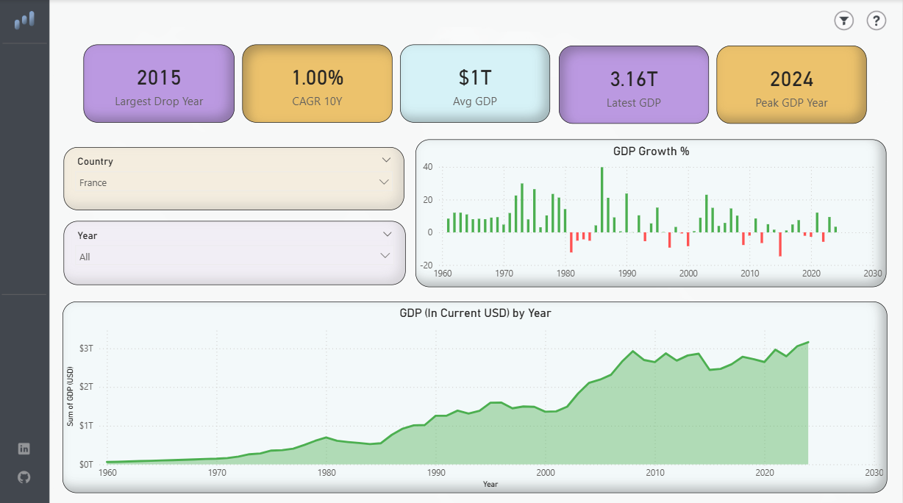
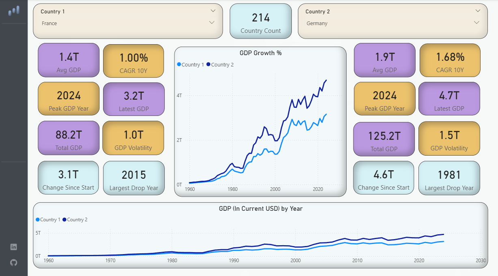

# 🌍 World GDP Analysis Dashboard

An end-to-end data analytics project that transforms raw World Bank GDP data into an interactive Power BI dashboard — featuring country-level exploration and head-to-head economic comparisons across 262 countries from 1960 to 2024.


## 📊 Dashboard Preview

### Country Overview


### Country Comparison



## 📁 Project Structure

```
GDP analysis/
├── Data/
│   ├── API_NY.GDP.MKTP.CD_DS2_en_csv_v2_2.csv   # Raw World Bank export
│   └── GDP_cleaned.csv                            # Processed dataset (14,561 rows)
├── Scripts/
│   └── cleanup.py                                 # Python ETL pipeline
├── Background/
│   ├── Background_1.png                           # Dashboard page 1 background
│   ├── Background_2.png                           # Dashboard page 2 background
│   └── Background_Template.png                    # Design template
├── Icons/
│   ├── icon_filter.svg
│   ├── icon_github.svg
│   ├── icon_linkedin.svg
│   ├── Icon_question.svg
│   └── icon_star.svg
├── Images/
│   ├── Dashboard_Overview.PNG                     # Page 1 screenshot
│   └── Country_Comparison.PNG                     # Page 2 screenshot
└── Dashboard.pbix                                 # Power BI report file
```


## 🔄 Data Pipeline

### Source
Raw data is sourced from the **World Bank Open Data** portal — indicator `NY.GDP.MKTP.CD` (GDP in current USD), exported as CSV (`API_NY.GDP.MKTP.CD_DS2_en_csv_v2_2.csv`). The file last updated on **2025-12-19** and covers **262 countries and regions** from **1960 to 2024**.

### ETL Script — `cleanup.py`

The Python script performs a four-stage cleaning pipeline:

| Stage | Function | Description |
|---|---|---|
| 1 | `load_raw_data()` | Detects and skips World Bank metadata rows; drops indicator columns |
| 2 | `melt_data()` | Reshapes from wide format (years as columns) to long format; drops null GDP rows |
| 3 | `add_classifications()` | Maps 50+ World Bank aggregate codes to Region, Income Group, Institutional, and Union labels |
| 4 | `clean_country_names()` | Strips classification strings embedded in country names for aggregate rows |

**Output:** `GDP_cleaned.csv` — 14,561 rows × 8 columns, sorted by country code and year (descending).

#### Cleaned Dataset Schema

| Column | Type | Description |
|---|---|---|
| `Country Name` | string | Full country or region name |
| `Country Code` | string | ISO 3166-1 alpha-3 / World Bank code |
| `Year` | int64 | Calendar year (1960–2024) |
| `GDP (USD)` | float64 | GDP in current US dollars |
| `Regions` | string | World Bank regional classification |
| `Income Group` | string | High / Upper-middle / Lower-middle / Low income |
| `Institutional` | string | IBRD / IDA classification |
| `Unions` | string | EU / Euro area membership |

#### Usage

```bash
python Scripts/cleanup.py \
  --input  Data/API_NY.GDP.MKTP.CD_DS2_en_csv_v2_2.csv \
  --output Data/GDP_cleaned.csv
```

**Requirements:** Python 3.8+, `pandas`


## 📈 Power BI Dashboard

The dashboard (`Dashboard.pbix`) consists of two interactive report pages.

### Page 1 — Country Overview

A single-country deep-dive with dynamic KPI cards and time-series visualizations.

**KPI Cards**
- Largest Drop Year
- 10-Year CAGR
- Average GDP (all-time)
- Latest GDP
- Peak GDP Year

**Visuals**
- **GDP Growth % (bar chart):** Year-over-year percentage change, color-coded green/red for growth/contraction
- **GDP in Current USD by Year (area chart):** Cumulative trajectory from 1960 to 2024

**Filters:** Country selector, Year range slicer

### Page 2 — Country Comparison

A side-by-side economic comparison between any two countries.

**Per-Country KPI Cards (×2)**
- Average GDP
- 10-Year CAGR
- Peak GDP Year
- Latest GDP
- Total GDP (cumulative)
- GDP Volatility
- Change Since Start
- Largest Drop Year

**Shared Visuals**
- **GDP Growth % (dual-line chart):** Overlaid year-over-year growth rates
- **GDP in Current USD by Year (dual-line chart):** Direct absolute comparison

**Filters:** Independent Country 1 and Country 2 selectors; Country Count KPI card showing the total in the dataset (214 individual countries, excluding aggregates)


## 🛠️ Tools & Technologies

| Tool | Purpose |
|---|---|
| Python 3 / pandas | Data cleaning and ETL |
| Power BI Desktop | Dashboard development and visualization |
| World Bank Open Data | Data source |
| SVG / PNG | Custom icons and backgrounds |


## 🚀 Getting Started

1. **Clone or download** this repository.
2. **Run the ETL script** (optional — cleaned data is already included):
   ```bash
   pip install pandas
   python Scripts/cleanup.py --input Data/API_NY.GDP.MKTP.CD_DS2_en_csv_v2_2.csv --output Data/GDP_cleaned.csv
   ```
3. **Open `Dashboard.pbix`** in Power BI Desktop.
4. If prompted, update the data source path to point to `Data/GDP_cleaned.csv`.
5. Refresh the dataset and explore.


## 📦 Data Coverage

- **262** countries and regional aggregates
- **65 years** of data: 1960–2024
- **14,561** clean data points
- Source updated: December 2025


## Source

Data sourced from the [World Bank Open Data](https://data.worldbank.org/) under the [Creative Commons Attribution 4.0 International License (CC BY 4.0)](https://creativecommons.org/licenses/by/4.0/).