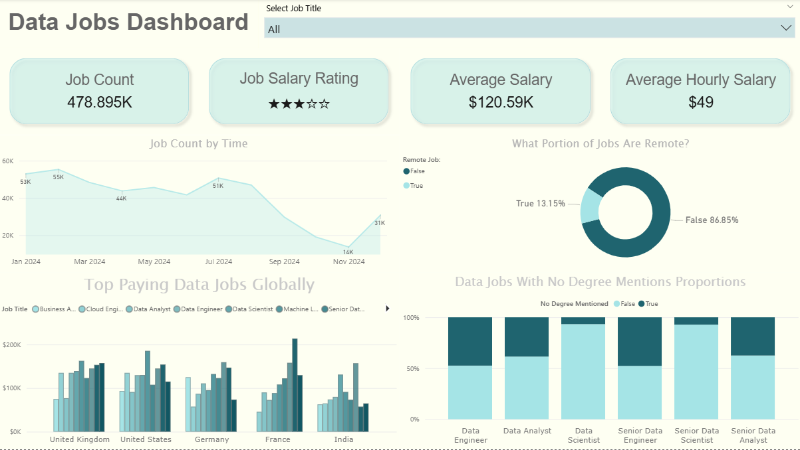
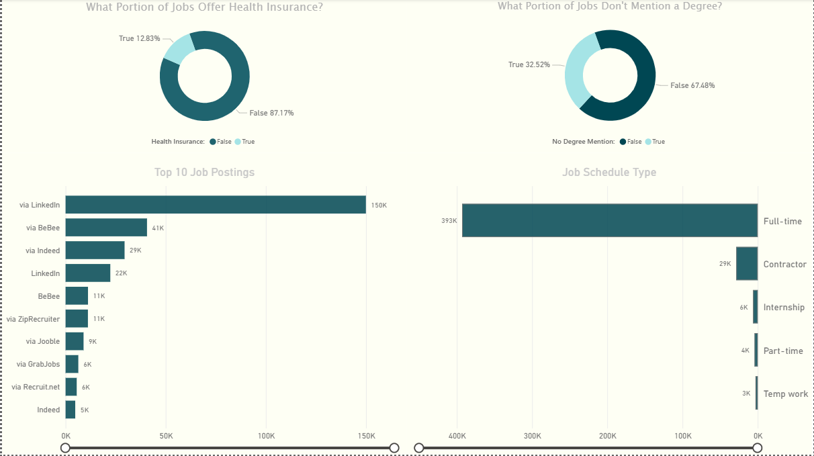

# Job Market Analysis Dashboard

A comprehensive analytics project visualizing data science job postings, including trends in roles, salaries, and skills. Interactive Power BI dashboards allow exploration of job counts, salary distributions, and role-specific details across the dataset.

## Dashboard Preview

### Overview Pages

  
*Figure: Main overview page of the Job Market dashboard, showing key KPIs and overall trends.*

  
*Figure: Secondary page with detailed breakdowns by job attributes (education, schedule type, etc).*

### Extended Analysis Pages

  
*Figure: Jobs by company (left) and average salary by company (right), highlighting top hiring firms.*

  
*Figure: Salary analysis page showing job count vs. median salary for different roles.*

  
*Figure: Jobs and salary by employment type (full-time, part-time, etc).*

  
*Figure: Jobs and average salary by skill, illustrating which skills have the most job postings and pay levels.*

  
*Figure: Detailed job postings table with fields like job title, country, salary bucket, skill count, company, and median salary, enabling granular analysis.*

## Project Structure

```
Job_analysis/
├── Dashboard/
│   ├── Dashboard.pbix             # Power BI report (executive summary dashboard)
│   ├── Dashboard_Extended.part1   # Extended report (zip file due to upload restrictions)
│   └── Dashboard_Extended.part2      
└── Images/                        # Screenshots for documentation
    ├── Dashboard/
    │   ├── dashboard_1.PNG
    │   └── Dashboard_2.PNG
    └── Dashboard Extended/
        ├── Companies.PNG
        ├── In Depth.PNG
        ├── Salary.PNG
        ├── Schedule Type.PNG
        └── Skills.PNG
```

## Data Pipeline

### Source

The job postings data is drawn from a publicly available dataset of 2024 data science job listings (often distributed as `job_postings_flat.csv`). This dataset includes fields for job title, company, location, salary, skills required, and other attributes, collected from online job platforms.

### ETL and Transformation

Data cleaning and preparation (such as combining fields, filtering records, and calculating metrics) are performed within Power BI using Power Query and DAX. There is no separate ETL script; the raw CSV is imported directly into the Power BI reports, where queries and measures shape the data for visualization.

### Cleaned Dataset Schema

The processed dataset (used in the dashboard) includes key columns like: 

- **JobTitle**: Role or position (e.g. Data Scientist, Data Analyst).  
- **Company**: Employer name.  
- **Country**, **City**: Location of the job posting.  
- **SalaryAnnual**: Annual salary midpoint (in USD).  
- **SalaryHourly**: Hourly wage (if provided).  
- **Rating**: Company or job rating (if available).  
- **EmploymentType**: Schedule (Full-time, Part-time, Contract, etc.).  
- **Skills**: Key skills required for the job.  
- **HealthInsurance**: Flag for health insurance benefit mentioned.  
- **DegreeRequired**: Flag for degree requirement.  
- **PostedDate**: Date the job was posted.  

Additional fields (like median salary, skill counts, or custom flags) are computed via DAX measures and appear in visuals and drill-through pages.

## Power BI Dashboard

Two Power BI reports are included: **Dashboard.pbix** (executive summary) and **Dashboard_Extended.pbix** (detailed analysis).

- **Dashboard.pbix (Executive Summary)** – A one-page overview of the job market.  
  - **KPI Cards:** Display total job count, average annual salary, average hourly wage, etc.  
  - **Job Trends (Line Chart):** Plots total job postings over time (e.g. monthly counts for 2024).  
  - **Skill Breakdown:** Bar charts showing *Jobs per Skill* and *Average Salary by Skill*, highlighting in-demand skills and their pay.  
  - **Filters:** A slicer for *Job Title* lets users focus on specific roles; selecting a title filters all visuals on the page.  

- **Dashboard_Extended.pbix (Detailed Analysis)** – A multi-page report for deeper exploration.  
  - **Company Analysis (Companies.PNG):** Bar charts for *Jobs per Company* and *Average Salary by Company*, highlighting top hiring companies (e.g. Dice, Capital One).  
  - **Salary Analysis (Salary.PNG):** A visualization (e.g. scatter or bar) comparing job count and median salary by role, showing which roles pay the most (e.g. Senior Data Engineer) and how many openings they have.  
  - **Schedule Type Analysis (Schedule Type.PNG):** Charts for *Jobs per Schedule Type* (Full-time, Part-time, Contractor, etc.) and *Average Salary by Schedule Type*, illustrating how employment type relates to pay.  
  - **Skills Analysis (Skills.PNG):** Similar to the summary skills chart, this page shows *Jobs per Skill* vs. *Average Salary by Skill* side by side, for detailed skill comparisons.  
  - **In-Depth Table (In Depth.PNG):** An interactive table listing postings with columns like Job Title, Country, Salary Bucket, Skill Count, Company, and Median Salary. Users can sort and filter this table or use it as a drill-through detail.  
  - **Demographics (if present):** Gauges or pie charts showing the percentage of jobs offering health insurance or requiring a degree, etc. (visible on the second overview page).  

All visuals are interactive. For example, clicking on a company or skill bar filters the entire report to that selection. Slicers and chart clicks cross-filter KPIs and charts on the same page, enabling exploratory analysis of the job market data.

## Getting Started

1. **Clone or download** this repository to your local machine.  
2. **Open the report files** in Power BI Desktop (`Dashboard.pbix` and `Dashboard_Extended.pbix`).  
3. If prompted, **update the data source** to point to the original `job_postings_flat.csv` (or place the CSV in the expected folder) and **refresh** the dataset.  
4. **Interact** with the dashboard: use the filters and click on charts to explore different slices of the data.

## Data Coverage

The data covers job postings throughout 2024 for data-related roles in various countries and industries. It includes a mix of entry-level and senior positions and captures both U.S. and global job markets, allowing trend analysis over the year and comparison across roles and regions.

## Tools & Technologies

| Tool                    | Purpose                                  |
|-------------------------|------------------------------------------|
| Power BI Desktop        | Dashboard authoring, data modeling, DAX  |
| Power Query (in Power BI) | Data import and transformation         |
| Microsoft Excel / CSV   | Data storage format for job postings     |
| Python / Pandas (optional) | Data preparation and analysis        |

## Key Features

- **Interactive Filtering:** Click on any bar, slicer, or table entry (e.g. a job title or skill) to dynamically filter all related visuals and KPIs.  
- **Summary KPIs:** Quick insights like total jobs, average salaries, and other benchmarks are shown via KPI cards.  
- **Trend Analysis:** Time series charts reveal how job demand and postings change over time.  
- **Skill & Role Insights:** Charts highlight the most common skills and highest-paying roles, helping identify market demand.  
- **Company Comparisons:** View which companies are hiring the most and compare their average offered salaries.  
- **Drill-Down Tables:** Detailed tables provide granular views of the data, enabling further filtering or drill-through to specific job details.

## Special Thanks and Source

Special Thanks to Luke Barousse for his wondeful data scraping project publicly available at [HuggingFace](https://huggingface.co/datasets/lukebarousse/data_jobs) also check out his own web based dashboard at [datanerd.tech](https://datanerd.tech/).