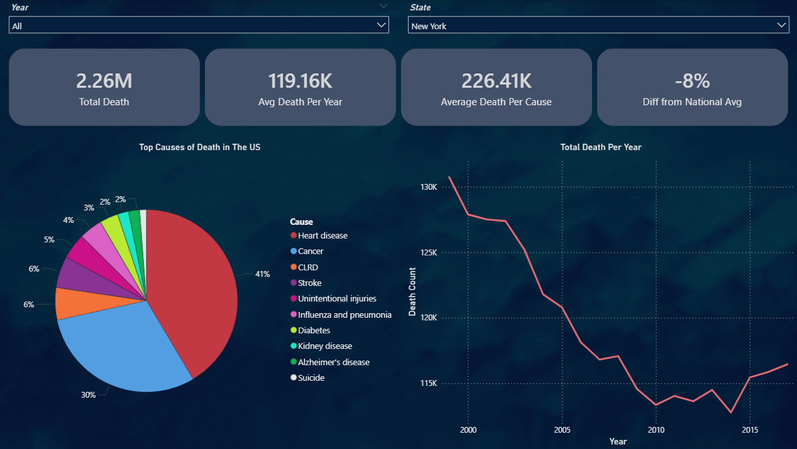

# US Mortality Analysis Dashboard

An end-to-end data analytics project that transforms raw CDC mortality data into an interactive Power BI dashboard, providing insights into the leading causes of death across the United States through dynamic filtering, trend analysis, and state-level exploration.


## Dashboard Preview

### Overview



## Project Structure

```
US_mortality_analysis/
├── Data/
│   ├── NCHS_-_Leading_Causes_of_Death_United_States.csv   # Raw CDC mortality dataset
│   └── Data_cleaned.csv                                   # Processed dataset
├── Scripts/
│   └── cleanup.py                                         # Python ETL pipeline
├── Images/
│   └── Overview.PNG                                       # Dashboard preview
├── Leading_causes_of_death_US_upto_2017_V2.pbix          # Power BI report
└── Readme.md
```


## Data Pipeline

### Source

Raw data is sourced from the CDC National Center for Health Statistics (NCHS) dataset containing the leading causes of death in the United States. The dataset includes annual death counts categorized by cause of death, state, and year.

### ETL Script

The Python cleaning pipeline prepares the raw dataset for Power BI by performing data cleaning, formatting, and validation before exporting the final dataset used by the dashboard.

**Output:** `Data_cleaned.csv`

### Usage

```bash
python Scripts/cleanup.py
```

**Requirements:** Python 3.8+, `pandas`


## Power BI Dashboard

The dashboard consists of a single interactive report page designed to explore mortality trends across the United States.

### KPI Cards

- Total Death
- Average Death Per Year
- Average Death Per Cause
- Difference from National Average

### Visuals

**Top Causes of Death (Pie Chart)**

Displays the distribution of deaths by cause, allowing users to quickly identify the largest contributors. Percentages included.

**Total Death Per Year (Line Chart)**

Shows how the total number of deaths changes over time for the selected filters, displaying long-term mortality trends.

### Filters

- Year slicer
- State slicer
- Pie Chart (You can select causes to filter the enite page)

All visuals interact dynamically. Selecting a state, year, or a cause of death updates the KPI cards and charts across the report.


## Tools & Technologies

| Tool | Purpose |
|---|---|
| Python 3 / pandas | Data cleaning and ETL |
| Power BI Desktop | Dashboard development and visualization |
| CDC National Center for Health Statistics | Data source |


## Getting Started

1. Clone or download this repository.
2. Run the data cleaning script if you want to regenerate the processed dataset.
   ```bash
   pip install pandas
   python Scripts/cleanup.py
   ```
3. Open `Leading_causes_of_death_US_upto_2017_V2.pbix` in Power BI Desktop.
4. If prompted, update the data source path to `Data/Data_cleaned.csv`.
5. Refresh the dataset and explore the dashboard.


## Features

- Explore mortality trends by year and state.
- Analyze the distribution of leading causes of death.
- Filter the entire dashboard by selecting causes directly from the pie chart.
- Compare state-level mortality against the national average using dynamic KPI cards.
- View yearly mortality trends that automatically respond to every filter selection.


## Source

This project uses publicly available mortality data provided by the Centers for Disease Control and Prevention (CDC) National Center for Health Statistics (NCHS). Please refer to the original data source for licensing and usage information.